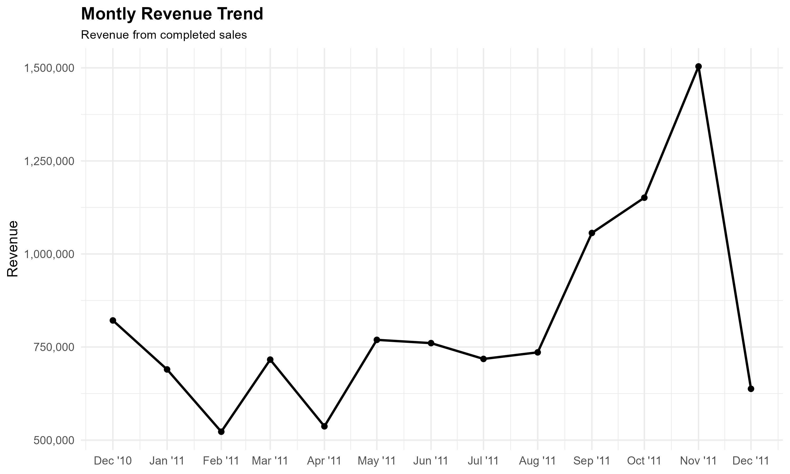
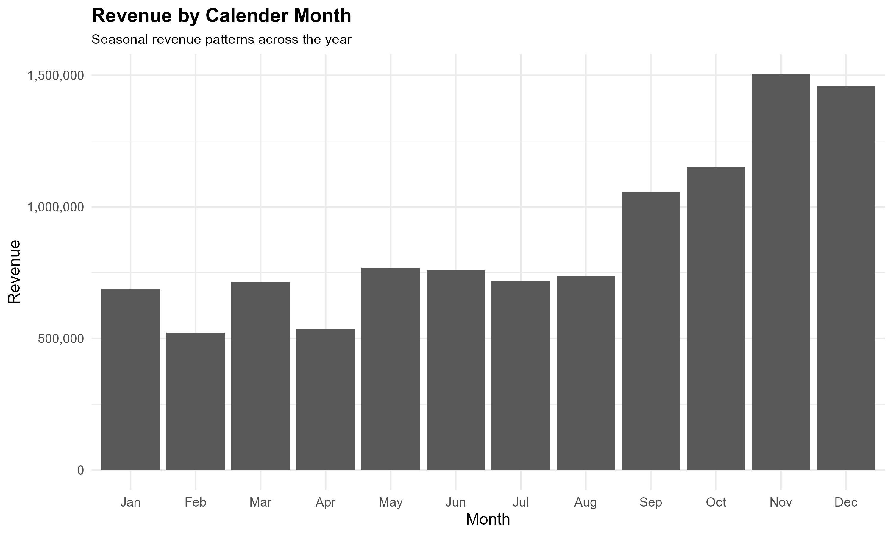

# Executive Summary

This report analyzes online retail transaction data to identify key sales, customer, product, geographic and cancellation trends.

The analysis focuses on understanding overall business performance, identifying high-performing products and customers, evaluating geographic patterns, and understanding cancellation activity.

# Introduction

## Business Context

Online retail businesses generate large volumes of transactional data that can be used to understand purchasing behavior, revenue patterns, product performance and customer activity.

This analysis uses historical online retail transaction data to explore these business questions.

## Objectives

The main objectives of this analysis are to:

-   Understand overall sales performance
-   Identify monthly and seasonal sales patterns
-   Identify high-value customers
-   Identify high-performing products
-   Compare country-level performance
-   Analyze order cancellations
-   Generate actionable business recommendations

## Analysis Areas

The analysis covers the following areas:

-   Sales Overview
-   Time Analysis
-   Customer Analysis
-   Product Analysis
-   Country Analysis
-   Cancellation Analysis

## Data Source

The analysis is based on the Online Retail transactional dataset.

The raw dataset is stored in:

`data/raw/Online_Retail.xlsx`

The analysis pipeline transforms the raw data into cleaned and feature-engineered datasets before the business analysis is performed.


# Sales Performance

## Overview

This section evaluates the overall sales performance of the online
retail business using revenue, order and customer-level metrics.

The analysis focuses on understanding the scale of the business and
identifying the overall sales trend across the available period.

### Overall Sales KPIs

```{r}
sales_overview <- readr::read_csv(
  "../outputs/tables/sales_overview.csv",
  show_col_types = FALSE
)

knitr::kable(
  sales_overview,
  digits = 2,
  caption = "Overall Sales Performance"
)
```

### Annual Sales Performance

Annual sales performance provides a high-level view of how revenue
changed across the available years.

```{r}
annual_sales <- readr::read_csv(
  "../outputs/tables/annual_sales.csv",
  show_col_types = FALSE
)

knitr::kable(
  annual_sales,
  digits = 2,
  caption = "Annual Sales Performance"
)
```

# Time & Seasonality Report

## Overview

Understanding when customers purchase is important for identifying
sales trends, seasonal demand and potential opportunities for
marketing, inventory planning and operational decisions.

This section examines revenue across the observation period,
calendar months, weekdays and hours of the day.


### Monthly Revenue Trend

The monthly revenue trend shows how revenue changed chronologically
throughout the available transaction period.

```{r}
monthly_sales <- readr::read_csv(
  "../outputs/tables/monthly_sales.csv",
  show_col_types = FALSE
)

knitr::kable(
  monthly_sales,
  digits = 2,
  caption = "Monthly Revenue Performance"
)
```

```{r}

```

The chronological monthly trend shows a clear increase in sales
activity during the second half of 2011. Revenue increased from
approximately 1.06 million in September to 1.15 million in October
and reached approximately 1.50 million in November.

November 2011 is the highest-revenue complete month in the dataset.
The lower December 2011 figure should not be interpreted as a decline
in performance because December is only partially represented in the
dataset.

::: {.callout-warning}
### Incomplete December 2011

The dataset ends on December 9, 2011 at approximately 12:50.
Therefore, December 2011 is a partial observation period and should
not be directly compared with complete calendar months.

November 2011 is the latest complete month in the dataset.
:::


### Calendar Month Seasonality

Calendar-month analysis aggregates transactions by month number
across the available years. This allows us to identify recurring
seasonal patterns independently of the chronological sequence.

```{r}
calendar_month_sales <- readr::read_csv(
  "../outputs/tables/calendar_month_sales.csv",
  show_col_types = FALSE
)

knitr::kable(
  calendar_month_sales,
  digits = 2,
  caption = "Revenue by Calendar Month"
)
```

```{r}

```

Calendar-month aggregation indicates stronger revenue concentration
toward the September–December period. November records the highest
calendar-month revenue at approximately 1.50 million, followed by
December at approximately 1.46 million.

The December result should nevertheless be interpreted with care
because the available data combines complete December 2010
observations with the incomplete December 2011 observation.

::: {.callout-note}
### Monthly Aggregation Method

Calendar-month results combine observations from the same calendar
month across different years. Therefore, this analysis is intended
to identify seasonal patterns rather than chronological revenue
growth.

For example, December 2010 and December 2011 contribute to the
overall December result.
:::


### Weekday Performance

Revenue is also evaluated by day of the week to identify differences
in purchasing activity across weekdays.

```{r}
weekday_sales <- readr::read_csv(
  "../outputs/tables/weekday_sales.csv",
  show_col_types = FALSE
)

knitr::kable(
  weekday_sales,
  digits = 2,
  caption = "Revenue by Day of Week"
)
```

```{r}
knitr::include_graphics(
  "../outputs/plots/weekday_revenue.png",
)
```

Revenue is concentrated during the working week. Thursday records
the highest revenue at approximately 2.20 million and also has the
highest order volume, with 4,408 orders. Sunday records the lowest
revenue among the observed weekdays at approximately 0.81 million.

This indicates a substantial difference in purchasing activity
between weekdays, with Thursday representing the strongest observed
day.


### Hourly Revenue Performance

Hourly analysis provides insight into the times of day when
transaction activity and revenue are highest

```{r}
hourly_sales <- readr::read_csv(
"../outputs/tables/hourly_sales.csv",
show_col_types = FALSE
)

knitr::kable(
  hourly_sales,
  digits = 2,
  caption = "Revenue by Hour of Day"
)
```

```{r}
knitr::include_graphics(
  "../outputs/plots/hourly_revenue.png",
)
```
Hourly analysis shows that revenue and transaction activity are
strongly concentrated during daytime hours, particularly between
09:00 and 16:00.

The 12:00 hour records the highest order volume at 3,323 orders,
while 10:00 records the highest hourly revenue at approximately
1.44 million. Revenue declines substantially after 16:00.


### Key Time-Based Insights

The time-based analysis identifies several important patterns in sales activity. 
Revenue increased substantially during the second half of 2011, with November 
2011 representing the highest-revenue complete month in the dataset at 
approximately 1.50 million. December 2011 is only partially observed and should 
therefore not be interpreted as a decline in performance.

Calendar-month aggregation indicates stronger revenue concentration toward the September–December period. However, the December result should be interpreted 
cautiously because it combines complete December 2010 observations with the 
incomplete December 2011 observation.

Revenue and order activity also vary across weekdays. Thursday records the 
highest observed revenue and order volume, while Sunday records the lowest 
revenue among the observed weekdays.

Hourly analysis shows that revenue and transaction activity are strongly 
concentrated during daytime hours, particularly between 09:00 and 16:00. 
The 12:00 hour records the highest order volume at 3,323 orders, while 10:00 
records the highest hourly revenue at approximately 1.44 million.

Overall, the findings indicate strong late-year sales activity, differences in 
purchasing activity across weekdays, and a clear concentration of transactions 
during daytime hours. These patterns can support operational planning, inventory management, staffing decisions, and targeted marketing activities.