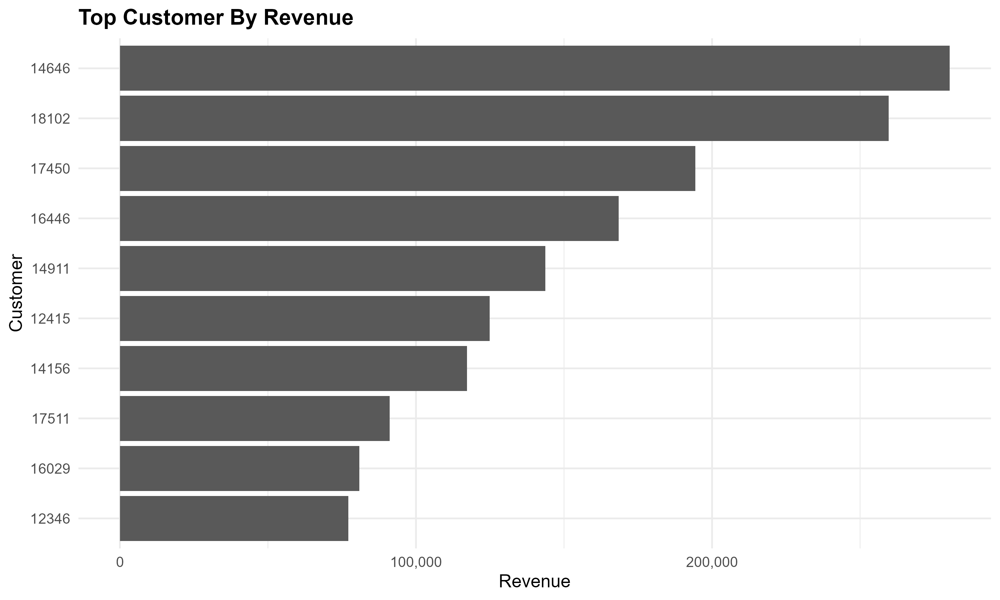
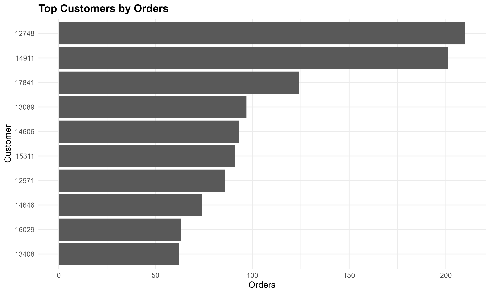
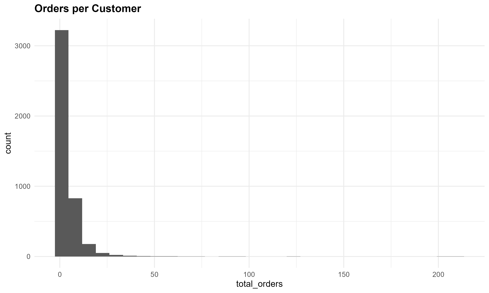
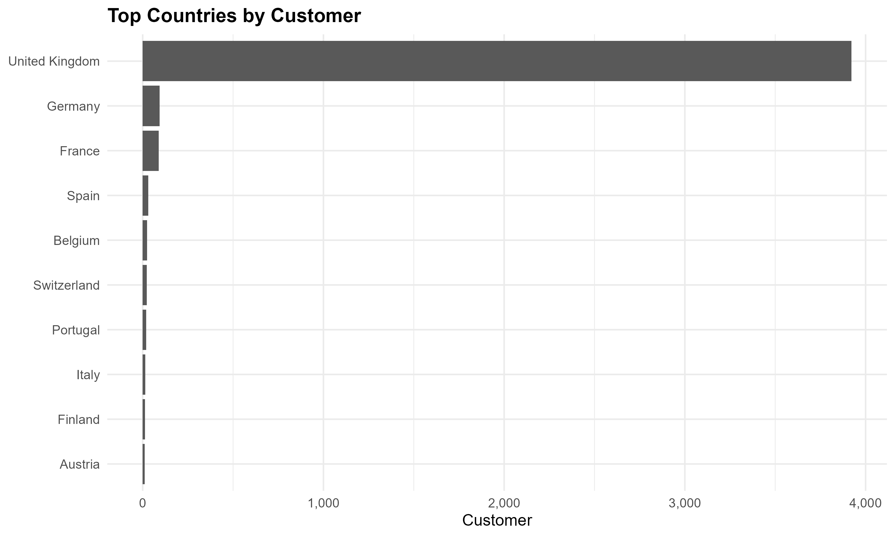

# Executive Summary

This report analyzes online retail transaction data to identify key sales, customer, product, geographic and cancellation trends.

The analysis focuses on understanding overall business performance, identifying high-performing products and customers, evaluating geographic patterns, and understanding cancellation activity.

# Introduction

## Business Context

Online retail businesses generate large volumes of transactional data that can be used to understand purchasing behavior, revenue patterns, product performance and customer activity.

This analysis uses historical online retail transaction data to explore these business questions.

## Objectives

The main objectives of this analysis are to:

-   Understand overall sales performance
-   Identify monthly and seasonal sales patterns
-   Identify high-value customers
-   Identify high-performing products
-   Compare country-level performance
-   Analyze order cancellations
-   Generate actionable business recommendations

## Analysis Areas

The analysis covers the following areas:

-   Sales Overview
-   Time Analysis
-   Customer Analysis
-   Product Analysis
-   Country Analysis
-   Cancellation Analysis

## Data Source

The analysis is based on the Online Retail transactional dataset.

The raw dataset is stored in:

`data/raw/Online_Retail.xlsx`

The analysis pipeline transforms the raw data into cleaned and feature-engineered datasets before the business analysis is performed.


# Sales Performance

## Overview

This section evaluates the overall sales performance of the online
retail business using revenue, order and customer-level metrics.

The analysis focuses on understanding the scale of the business and
identifying the overall sales trend across the available period.

### Overall Sales KPIs

```{r}
sales_overview <- readr::read_csv(
  "../outputs/tables/sales_overview.csv",
  show_col_types = FALSE
)

knitr::kable(
  sales_overview,
  digits = 2,
  caption = "Overall Sales Performance"
)
```

### Annual Sales Performance

Annual sales performance provides a high-level view of how revenue
changed across the available years.

```{r}
annual_sales <- readr::read_csv(
  "../outputs/tables/annual_sales.csv",
  show_col_types = FALSE
)

knitr::kable(
  annual_sales,
  digits = 2,
  caption = "Annual Sales Performance"
)
```


# Time & Seasonality Report

## Overview

Understanding when customers purchase is important for identifying
sales trends, seasonal demand and potential opportunities for
marketing, inventory planning and operational decisions.

This section examines revenue across the observation period,
calendar months, weekdays and hours of the day.


### Monthly Revenue Trend

The monthly revenue trend shows how revenue changed chronologically
throughout the available transaction period.

```{r}
monthly_sales <- readr::read_csv(
  "../outputs/tables/monthly_sales.csv",
  show_col_types = FALSE
)

knitr::kable(
  monthly_sales,
  digits = 2,
  caption = "Monthly Revenue Performance"
)
```

```{r}
knitr::include_graphics(
  "../outputs/plots/monthly_revenue.png"
)
```

The chronological monthly trend shows a clear increase in sales
activity during the second half of 2011. Revenue increased from
approximately 1.06 million in September to 1.15 million in October
and reached approximately 1.50 million in November.

November 2011 is the highest-revenue complete month in the dataset.
The lower December 2011 figure should not be interpreted as a decline
in performance because December is only partially represented in the
dataset.

::: {.callout-warning}
### Incomplete December 2011

The dataset ends on December 9, 2011 at approximately 12:50.
Therefore, December 2011 is a partial observation period and should
not be directly compared with complete calendar months.

November 2011 is the latest complete month in the dataset.
:::


### Calendar Month Seasonality

Calendar-month analysis aggregates transactions by month number
across the available years. This allows us to identify recurring
seasonal patterns independently of the chronological sequence.

```{r}
calendar_month_sales <- readr::read_csv(
  "../outputs/tables/calendar_month_sales.csv",
  show_col_types = FALSE
)

knitr::kable(
  calendar_month_sales,
  digits = 2,
  caption = "Revenue by Calendar Month"
)
```

```{r}
knitr::include_graphics(
  "../outputs/plots/calendar_month_sales.png"
)
```

Calendar-month aggregation indicates stronger revenue concentration
toward the September–December period. November records the highest
calendar-month revenue at approximately 1.50 million, followed by
December at approximately 1.46 million.

The December result should nevertheless be interpreted with care
because the available data combines complete December 2010
observations with the incomplete December 2011 observation.

::: {.callout-note}
### Monthly Aggregation Method

Calendar-month results combine observations from the same calendar
month across different years. Therefore, this analysis is intended
to identify seasonal patterns rather than chronological revenue
growth.

For example, December 2010 and December 2011 contribute to the
overall December result.
:::


### Weekday Performance

Revenue is also evaluated by day of the week to identify differences
in purchasing activity across weekdays.

```{r}
weekday_sales <- readr::read_csv(
  "../outputs/tables/weekday_sales.csv",
  show_col_types = FALSE
)

knitr::kable(
  weekday_sales,
  digits = 2,
  caption = "Revenue by Day of Week"
)
```

```{r}
knitr::include_graphics(
  "../outputs/plots/weekday_revenue.png",
)
```

Revenue is concentrated during the working week. Thursday records
the highest revenue at approximately 2.20 million and also has the
highest order volume, with 4,408 orders. Sunday records the lowest
revenue among the observed weekdays at approximately 0.81 million.

This indicates a substantial difference in purchasing activity
between weekdays, with Thursday representing the strongest observed
day.


### Hourly Revenue Performance

Hourly analysis provides insight into the times of day when
transaction activity and revenue are highest

```{r}
hourly_sales <- readr::read_csv(
"../outputs/tables/hourly_sales.csv",
show_col_types = FALSE
)

knitr::kable(
  hourly_sales,
  digits = 2,
  caption = "Revenue by Hour of Day"
)
```

```{r}
knitr::include_graphics(
  "../outputs/plots/hourly_revenue.png",
)
```
Hourly analysis shows that revenue and transaction activity are
strongly concentrated during daytime hours, particularly between
09:00 and 16:00.

The 12:00 hour records the highest order volume at 3,323 orders,
while 10:00 records the highest hourly revenue at approximately
1.44 million. Revenue declines substantially after 16:00.


### Key Time-Based Insights

The time-based analysis identifies several important patterns in sales activity. 
Revenue increased substantially during the second half of 2011, with November 
2011 representing the highest-revenue complete month in the dataset at 
approximately 1.50 million. December 2011 is only partially observed and should 
therefore not be interpreted as a decline in performance.

Calendar-month aggregation indicates stronger revenue concentration toward the September–December period. However, the December result should be interpreted 
cautiously because it combines complete December 2010 observations with the 
incomplete December 2011 observation.

Revenue and order activity also vary across weekdays. Thursday records the 
highest observed revenue and order volume, while Sunday records the lowest 
revenue among the observed weekdays.

Hourly analysis shows that revenue and transaction activity are strongly 
concentrated during daytime hours, particularly between 09:00 and 16:00. 
The 12:00 hour records the highest order volume at 3,323 orders, while 10:00 
records the highest hourly revenue at approximately 1.44 million.

Overall, the findings indicate strong late-year sales activity, differences in 
purchasing activity across weekdays, and a clear concentration of transactions 
during daytime hours. These patterns can support operational planning, inventory management, staffing decisions, and targeted marketing activities.


# Customer Performance

## Overview

Customer analysis provides insight into the size, value, frequency, and retention characteristics of the customer base.

This section evaluates customer revenue, order frequency, average order value, purchasing volume, and repeat-purchase behavior. It also identifies high-value and high-frequency customers to understand the different ways customers contribute to overall business performance.


### Customer Base Overview

The customer base is summarized using the number of unique customers, average revenue per customer, average number of orders, average units purchased, and average order value.

```{r}
customer_statistics <- readr::read_csv(
  "../outputs/tables/customer_statistics.csv",
  show_col_types = FALSE
)

knitr::kable(
  customer_statistics,
  digits = 2,
  caption = "Customer Base Statistics"
)
```
The analysis identifies 4,339 unique customers. Customers place an average of 4.27 orders and generate approximately 2,048 in revenue on average. The average order value is approximately 418.

The customer base therefore includes both relatively frequent repeat purchasers and customers with limited purchasing activity.


### Customer Retention

Repeat purchasing is an important indicator of customer engagement. Customers are classified as repeat customers when they have placed more than one order, while customers with a single order are classified as one-time customers.

```{r}
customer_retention <- customer_statistics |>
  dplyr::filter(Metric %in% c("Repeat Customers", "One-Time Customers")) |>
  dplyr::mutate(
    Customer_Type = Metric,
    Customers = Value,
    Percentage = Value / customer_statistics$Value[
      customer_statistics$Metric == "Unique Customers"
    ] * 100
  ) |>
  dplyr::select(Customer_Type, Customers, Percentage)

knitr::kable(
  customer_retention,
  digits = 1,
  caption = "Customer Repeat-Purchase Profile"
)
```
Repeat customers account for approximately 65.6% of the customer base, while one-time customers account for approximately 34.4%.

This indicates that repeat purchasing represents an important component of customer activity. The proportion of one-time customers also represents a potential opportunity for targeted retention and re-engagement strategies.


### Top Customers by Revenue

The highest-revenue customers are examined to identify customers who contribute substantially to overall sales.

```{r}
top_customers_revenue <- readr::read_csv(
  "../outputs/tables/top_customers_revenue.csv",
  show_col_types = FALSE
)

knitr::kable(
  top_customers_revenue,
  digits = 2,
  caption = "Top Customers by Revenue"
)
```

```{r}

```

Customer revenue is highly concentrated among a relatively small number of customers.

Customer 14646 generates approximately 280.2K in revenue across 74 orders, while customer 18102 generates approximately 259.7K across 60 orders. Customer 17450 generates approximately 194.4K across 46 orders.

The results also show that high customer revenue can arise from very different purchasing patterns. For example, customer 14911 generates approximately 143.7K across 201 orders, indicating high-frequency purchasing, whereas customer 16446 generates approximately 168.5K from only two orders.

This demonstrates that customer value should not be evaluated using revenue alone. Order frequency and average order value provide important additional context.

::: {.callout-warning}

High-Value Customer Outliers

Some customers generate exceptionally large revenue despite placing only a small number of orders.

These observations should be investigated separately because the underlying Online Retail dataset contains unusually large-volume transactions and cancellation records. High-value observations should therefore not automatically be interpreted as representative customer behavior.
:::


### Most Frequent Customers

Customer frequency provides a different perspective on customer engagement by identifying customers with the highest number of orders.

```{r}
top_customers_orders <- readr::read_csv(
  "../outputs/tables/top_customers_orders.csv",
  show_col_types = FALSE
)

knitr::kable(
  top_customers_orders,
  digits = 2,
  caption = "Top Customers by Numbers of Orders"
)
```

```{r}

```
Customer 12748 is the most frequent purchaser, with 210 orders, followed by customer 14911 with 201 orders.

The comparison between these customers demonstrates that order frequency and customer revenue do not necessarily move together. Customer 12748 has a substantially lower average order value than customer 14911 despite having a similar number of orders.

This suggests that customer segmentation should consider multiple dimensions, including revenue, order frequency, and average order value.


### Customer Order Distribution

The distribution of orders per customer provides an overview of purchasing frequency across the wider customer base.

```{r}

```

The customer order distribution shows that purchasing frequency varies considerably across the customer base. A substantial proportion of customers place relatively few orders, while a smaller group of highly engaged customers places orders much more frequently.

This pattern supports the distinction between one-time, repeat, and highly frequent customers when evaluating customer engagement.


### Geographic Customer Concentration

The table below summarizes customer activity across countries.

```{r}
top_countries_customers <- readr::read_csv(
  "../outputs/tables/top_countries_customers.csv",
  show_col_types = FALSE
)

knitr::kable(
  top_countries_customers,
  digits = 2,
  caption = "Top Countries by Customer Activity"
)
```


```{r}

```

The United Kingdom accounts for approximately 3,922 customers, 18,786 orders, and 8.98 million in revenue, making it by far the largest customer market in the dataset.

Germany and France have substantially smaller customer bases, with 94 and 88 customers respectively. Their revenue contributions are also considerably lower than those of the United Kingdom.

This indicates a strong concentration of the customer base in the United Kingdom. While the domestic market represents the core customer base, the relatively smaller customer populations in other countries may indicate opportunities for international customer acquisition and market expansion.


### Customer Performance Insights

The customer analysis identifies several important patterns.

First, the business has a relatively strong repeat-customer base, with approximately 65.6% of customers placing more than one order. However, approximately 34.4% of customers are one-time purchasers, representing a potential opportunity for customer retention and re-engagement.

Second, customer value varies substantially. Some high-value customers generate revenue through frequent purchases, while others generate substantial revenue through a small number of unusually large orders. This highlights the importance of evaluating customers using multiple measures rather than relying on revenue alone.

Third, customer frequency and customer value are not necessarily equivalent. Customer 12748 has the highest number of orders, while customer 14911 combines similarly high purchasing frequency with substantially higher revenue.

Finally, the customer base is highly concentrated in the United Kingdom. This provides a strong domestic customer foundation while also highlighting the potential for international customer growth.

Overall, customer performance analysis indicates that retention of valuable repeat customers, re-engagement of one-time customers, and identification of high-value purchasing segments could support future customer-focused strategies.